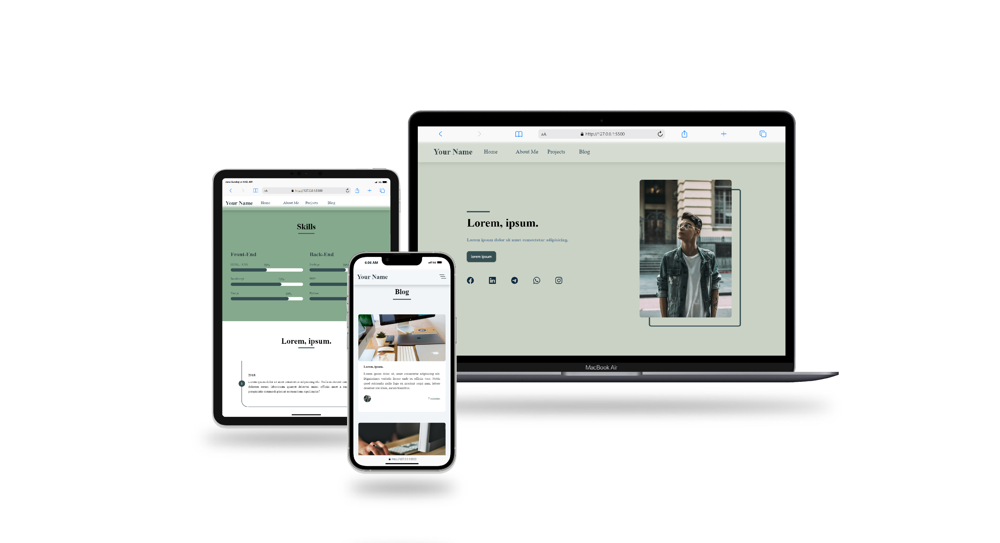

# Personal Portfolio
a Personal Portfolio website template for introducing yourself to your audience and employers.

This template supports the content needed by a person as a developer, blogger, content producer, or etc. This template includes the following:

***Home***, ***About Me***, ***Services***, ***Projects***, ***Contact Me***, ***Skills***, ***Timeline***, and ***Blog***.

Fork [this repository](https://github.com/reza-azimifar/personal-portfolio), modify the configuration and files and have your personal portfolio website for free by publishing this code on [github pages](https://pages.github.com/) or any other domain.

## Demo
Here you can check the [Demo](https://reza-azimifar.github.io/personal-portfolio/) online:

## Getting started
+ Register a `GitHub` account
+ Fork this repository by clicking the `fork` button in the top right
+ Go to the repository’s settings and rename the repository `[Your GitHub Username].github.io`, which will also be your website’s URL
+ Add all dependencies to the project by executing the `npm install` in the command line.
+ Set site-wide configuration as see below description

## Pages setup and main configuration
The main configuration file for the website is the `index.html` file in the directory which defines the content of the navbar and other site-wide features.

It would be best if you replaced the default values of the navigation bar and descriptions and contents in other sections of the `index.html` file with your desired content.

Also, it is better to replace the titles of the buttons with the values you need and adjust the links of the buttons to the relevant sections based on your needs.

Set the link of your social pages and adjust the icons, titles, and links in the footer section according to your needs.

In the end, by executing the `npm run sass` in the command line create the final production version and only upload the files on your host

## Files
You can upload and replace your images as the below template in the `images` directory. 

+ Your first image in the hero section: `hero-img.jpg`
+ Your second image in the about me section: `about-img.jpg`
+ Your projects images in the projects section: `img-1.jpg` , `img-2.jpg` , `img-3.jpg` , `img-4.jpg`
  

## Authors
Reza Azimifar

